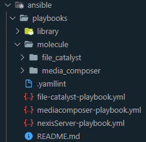
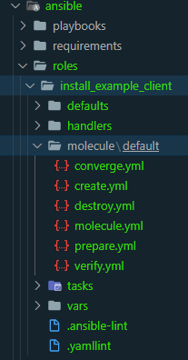

# Understanding the Molecule structure #

## About Ansible Molecule ##

According to its official documentation, Molecule is a project:

&emsp;*“designed to aid in the development and testing of Ansible roles. It
encourages an approach that results in consistently developed roles that
are well-written, easily understood and maintained.”*

In a more simple way, Molecule tests your Anisble code. With Molecule you can
easily run multiple tests against your Ansible roles/playbooks and make sure
that they work as expected before deploying.

Some things tested by Molecule:

- Linting of Yaml and Ansible code
- Ansible syntax checking
- Run of the role(s) on a virtual machine (VM)
- Validation of the role(s) execution on the VM
- Idempotence (test the same role(s) on the same VM a second time)

## Molecule structure in an Anisble Playbook ##

The Molecule directory structure for Ansible Playbooks consists of a Molecule
head directory with a folder for each created scenario.
Below is an example of multiple scenarios in a playbook directory structure



### Playbook Molecule.yml ###

Holds the default configuration for molecule.

#### Playbook Molecule.yml Linux ####

```bash
---
dependency:
  name: galaxy
driver:
  name: azure
platforms:
  - name: linuxexample
    resource_group_name: "ECD-Molecule-linux_exmample"
    vm_size: Standard_B1s
    image:
      offer: CentOS
      publisher: OpenLogic
      sku: '7.4'
      version: latest
provisioner:
  name: ansible
verifier:
  name: testinfra
  directory: "../../../roles/install_linux_client/molecule/default/tests"
  additional_files_or_dirs:
    - "../../../../install_other_client/molecule/default/tests/test_*"
lint: |
  set -e
  yamllint .
scenario:
  test_sequence:
    - dependency
    - lint
    - cleanup
    - destroy
    - syntax
    - create
    - prepare
    - converge
    - side_effect
    - verify
    - cleanup
    - destroy
```

Important sections to note:

Platforms: This sections defines the information required to provision the VM
for testing on.

- name: the name of the VM
- resource_group_name: the name of the Azure resource group
- vm_size: the Azure VM size SKU
- image: the image information for the VM OS, this includes the offer, publisher,
sku and version.

Verifier: This section defines the test framework to use and any configuration
needed for the testing framework.

- name: the verifier to use, in the case of Linux we are using testinfra
- directory: the main testing files location (set to the first role of the playbook)
- additional_file_or_dir: this specifies the other roles test files locations,
any addition tests should be added to this list

#### Playbook Molecule.yml Windows ####

```bash
---
dependency:
  name: galaxy
driver:
  name: azure
platforms:
  - name: "windows-example"
    resource_group_name: "ECD-Molecule-windows-example"
    vm_size: Standard_NV12
    image:
      offer: Windows-10
      publisher: MicrosoftWindowsDesktop
      sku: 'rs5-pro'
      version: latest
provisioner:
  name: ansible
  connection_options:
    become: true
    become_method: runas
    become_user: SYSTEM
    ansible_password: *^^^&*$*
    ansible_user: molecule
    ansible_connection: winrm
    ansible_winrm_transport: basic
    ansible_winrm_scheme: https
    ansible_winrm_server_cert_validation: ignore
    ansible_shell_type: powershell
verifier:
  name: ansible
playbooks:
  prepare: prepare.yml
lint: |
  set -e
  yamllint .
scenario:
  test_sequence:
    - dependency
    - lint
    - cleanup
    - destroy
    - syntax
    - create
    - prepare
    - converge
    - side_effect
    - verify
    - cleanup
    - destroy

```

Important sections to note:

Platforms: This sections defines the information required to provision the VM
for testing on.

- name: the name of the VM
- resource_group_name: the name of the Azure resource group
- vm_size: the Azure VM size SKU
- image: the image information for the VM OS, this includes the offer, publisher,
sku and version.

Provisioner:

- name: the name of the provisioner to use (always ansible in our use)
- connections options: This section defines some important information for
Ansible to connect to the remote VM. This included the username/password,
the connection type, and shell to use.

### Playbook Create.yml ###

Defines the steps to perform to provision an Azure-based VM
and required infrastructure, which will be used for testing.

#### Playbook Create.yml Linux ####

```bash
---
- name: Create
  hosts: localhost
  connection: local
  gather_facts: false

  vars:
    resource_group_name: "ECD-Molecule-linux-example"
    ssh_user: molecule
    ssh_port: 22
    keypair_path: "{{ lookup('env', 'MOLECULE_EPHEMERAL_DIRECTORY') }}/ssh_key"

  tasks:
    - name: Check for set resource group
      fail:
        msg: "Resource group is not set in < vars.resource_group_name >."
      when: (vars.resource_group_name is undefined) or vars.resource_group_name == ""

    - name: Create resource group
      azure_rm_resourcegroup:
        name: "{{ vars.resource_group_name }}"
        location: "eastus"

    - name: Create virtual network
      azure_rm_virtualnetwork:
        resource_group: "{{ vars.resource_group_name }}"
        name: "{{ vars.resource_group_name }}-NET"
        address_prefixes: "10.10.0.0/16"

    - name: Create subnet
      azure_rm_subnet:
        resource_group: "{{ vars.resource_group_name }}"
        name: "{{ vars.resource_group_name }}-sub"
        address_prefix_cidr: 10.10.1.0/24
        virtual_network_name: "{{ vars.resource_group_name }}-NET"

    - name: Create keypair
      user:
        name: "{{ ssh_user }}"
        generate_ssh_key: true
        ssh_key_file: "{{ keypair_path }}"
      register: keypair

    - name: Create molecule instance(s)
      azure_rm_virtualmachine:
        resource_group: "{{ item.resource_group_name }}"
        name: "{{ item.name }}"
        vm_size: "{{ item.vm_size }}"
        managed_disk_type: "Standard_LRS"
        admin_username: "{{ ssh_user }}"
        public_ip_allocation_method: Dynamic
        ssh_password_enabled: false
        ssh_public_keys:
          - path: "/home/{{ ssh_user }}/.ssh/authorized_keys"
            key_data: "{{ keypair.ssh_public_key }}"
        image: "{{ item.image }}"
      register: server
      with_items: "{{ molecule_yml.platforms }}"
      async: 7200
      poll: 0

    - name: Wait for instance(s) creation to complete
      async_status:
        jid: "{{ item.ansible_job_id }}"
      register: azure_jobs
      until: azure_jobs.finished
      retries: 300
      with_items: "{{ server.results }}"

    # Mandatory configuration for Molecule to function.
    - name: Populate instance config dictionary
      set_fact:
        instance_conf_dict: {
          'instance': "{{ item.ansible_facts.azure_vm.name }}",
          'address': "{{ item.ansible_facts.azure_vm.properties.networkProfile.networkInterfaces[0].properties.ipConfigurations[0].properties.publicIPAddress.properties.ipAddress }}",
          'user': "{{ ssh_user }}",
          'port': "{{ ssh_port }}",
          'identity_file': "{{ keypair_path }}",
        }
      with_items: "{{ azure_jobs.results }}"
      register: instance_config_dict
      when: server.changed | bool

    - name: Convert instance config dictionary to a list
      set_fact:
        instance_conf: "{{ instance_config_dict.results | map(attribute='ansible_facts.instance_conf_dict') | list }}"
      when: server.changed | bool

    - name: Dump instance config
      copy:
        content: "{{ instance_conf | to_json | from_json }}"
        dest: "{{ molecule_instance_config }}"
      when: server.changed | bool

    - name: Wait for SSH
      wait_for:
        port: "{{ ssh_port }}"
        host: "{{ item.address }}"
        search_regex: SSH
        delay: 10
      with_items: "{{ lookup('file', molecule_instance_config) }}"

```

__Important file notes__:

While most steps are self explaintory such as creating the Azure resource group
and creating the virtual network, it is important to not that Linux VMs use SSH
as the connection method. As such, in this file, we have a step that creates a
random generated SSH key.

#### Playbook Create.yml Windows ####

```bash
---
- hosts: localhost
  tasks:
    - name: Prepare random postfix
      set_fact:
        rpfx: "{{ 100000 | random }}"
      run_once: true
    - name: Set random storage name
      set_fact:
        storage_account: "store{{ rpfx }}"

- name: provision new azure host
  hosts: localhost
  connection: local
  vars:
    resourcegroupname: "ECD-Molecule-windows-example"
    vm_name: "windows-example"
    vm_user: molecule
    vm_password:**^^^**
    location: eastus
    winrm_port: 5986
    # Below is UTF-16 Base64 encoding for:
    #   Invoke-Expression -Command ((New-Object System.Net.WebClient).DownloadString('https://raw.githubusercontent.com/ansible/ansible/devel/examples/scripts/ConfigureRemotingForAnsible.ps1')); Enable-WSManCredSSP -Role Server -Force
    winrm_enable_script: SQBuAHYAbwBrAGUALQBFAHgAcAByAGUAcwBzAGkAbwBuACAALQBDAG8AbQBtAGEAbgBkACAAKAAoAE4AZQB3AC0ATwBiAGoAZQBjAHQAIABTAHkAcwB0AGUAbQAuAE4AZQB0AC4AVwBlAGIAQwBsAGkAZQBuAHQAKQAuAEQAbwB3AG4AbABvAGEAZABTAHQAcgBpAG4AZwAoACcAaAB0AHQAcABzADoALwAvAHIAYQB3AC4AZwBpAHQAaAB1AGIAdQBzAGUAcgBjAG8AbgB0AGUAbgB0AC4AYwBvAG0ALwBhAG4AcwBpAGIAbABlAC8AYQBuAHMAaQBiAGwAZQAvAGQAZQB2AGUAbAAvAGUAeABhAG0AcABsAGUAcwAvAHMAYwByAGkAcAB0AHMALwBDAG8AbgBmAGkAZwB1AHIAZQBSAGUAbQBvAHQAaQBuAGcARgBvAHIAQQBuAHMAaQBiAGwAZQAuAHAAcwAxACcAKQApADsAIABFAG4AYQBiAGwAZQAtAFcAUwBNAGEAbgBDAHIAZQBkAFMAUwBQACAALQBSAG8AbABlACAAUwBlAHIAdgBlAHIAIAAtAEYAbwByAGMAZQA=

  tasks:
    - name: Check for set resource group
      fail:
        msg: "Resource group is not net in < vars.resourcegroupname >."
      when: (vars.resourcegroupname is undefined)

    - name: create Azure resource group
      azure_rm_resourcegroup:
        name: "{{ vars.resourcegroupname }}"
        location: '{{ vars.location }}'
        state: present

    - name: create Azure virtual network in resource group
      azure_rm_virtualnetwork:
        name: "{{ vars.vm_name }}"
        resource_group: "{{ vars.resourcegroupname }}"
        address_prefixes_cidr:
          - 10.1.0.0/16
        state: present

    - name: create Azure subnet in virtualnetwork
      azure_rm_subnet:
        name: '{{ vars.vm_name }}'
        state: present
        virtual_network_name: "{{ vars.vm_name }}"
        resource_group: "{{ vars.resourcegroupname }}"
        address_prefix_cidr: 10.1.0.0/24

    - name: Create public ip
      azure_rm_publicipaddress:
        resource_group: "{{ vars.resourcegroupname }}"
        allocation_method: Dynamic
        domain_name: "{{ vars.vm_name}}"
        name: "{{ vars.vm_name }}ip01"

    - name: Create security group that allows WINRM
      azure_rm_securitygroup:
        resource_group: "{{ vars.resourcegroupname }}"
        name: "{{ vars.vm_name }}sg01"
        rules:
          - name: WINRM
            destination_port_range: "{{ winrm_port }}"
            access: Allow
            priority: 101
            direction: Inbound

    - name: Create NIC
      azure_rm_networkinterface:
        resource_group: "{{ vars.resourcegroupname }}"
        name: "{{ vars.vm_name }}uni01"
        virtual_network: "{{ vars.vm_name }}"
        subnet: "{{ vars.vm_name }}"
        public_ip_name: "{{ vars.vm_name }}ip01"
        security_group: "{{ vars.vm_name }}sg01"

    - name: create Azure storage account
      azure_rm_storageaccount:
        name: "{{ storage_account }}"
        resource_group: "{{ vars.resourcegroupname }}"
        account_type: Standard_LRS


    - name: provision new Azure virtual host
      azure_rm_virtualmachine:
        admin_username: '{{ vars.vm_user }}'
        admin_password: "{{ vars.vm_password }}"
        os_type: Windows
        image: "{{ item.image }}"
        name: "{{ item.name }}"
        resource_group: "{{ item.resource_group_name }}"
        state: present
        vm_size: "{{ item.vm_size }}"
        storage_account_name: "{{ storage_account }}"
        network_interfaces: "{{ vars.vm_name }}uni01"
      register: server
      with_items: "{{ molecule_yml.platforms }}"
      async: 7200
      poll: 0

    - name: Wait for instance(s) creation to complete
      async_status:
        jid: "{{ item.ansible_job_id }}"
      register: azure_jobs
      until: azure_jobs.finished
      retries: 300
      with_items: "{{ server.results }}"

    - name: create Azure vm extension to enable HTTPS WinRM listener
      azure_rm_virtualmachine_extension:
        name: winrm-extension
        resource_group: "{{ vars.resourcegroupname }}"
        virtual_machine_name: "{{ vars.vm_name }}"
        publisher: Microsoft.Compute
        virtual_machine_extension_type: CustomScriptExtension
        type_handler_version: 1.9
        settings: '{"commandToExecute": "powershell.exe -ExecutionPolicy ByPass -EncodedCommand {{winrm_enable_script}}"}'
        auto_upgrade_minor_version: true

    - name: Get facts for one private ip
      azure_rm_networkinterface_info:
        resource_group: "{{ vars.resourcegroupname }}"
        name: "{{ vars.vm_name }}"
      register: privateipaddress

    - name: set private ip address fact
      set_fact: privateipaddress="{{ privateipaddress | json_query('networkinterfaces[0].ip_configurations[0].private_ip_address')}}"

    - name: wait for the WinRM port to come online
      wait_for:
        port: "{{ vars.winrm_port }}"
        host: '{{azure_vm.properties.networkProfile.networkInterfaces[0].properties.ipConfigurations[0].properties.publicIPAddress.properties.ipAddress}}'
        timeout: 600

    - name: Populate instance config dict
      set_fact:
        instance_conf_dict: {
          'instance': "{{ item.ansible_facts.azure_vm.name }}",
          'address': "{{ azure_vm.properties.networkProfile.networkInterfaces[0].properties.ipConfigurations[0].properties.publicIPAddress.properties.ipAddress }}",
          'user': "{{ vars.vm_user }}",
          'password': "{{ vars.vm_password }}",
          'port': "{{ vars.winrm_port }}",
          'identity_file': ""}
      with_items: "{{ azure_jobs.results }}"
      register: instance_config_dict
      when: server.changed | bool
    - name: Convert instance config dict to a list
      set_fact:
        instance_conf: "{{ instance_config_dict.results | map(attribute='ansible_facts.instance_conf_dict') | list }}"
      when: server.changed | bool
    - name: Dump instance config
      copy:
        content: "{{ instance_conf | to_json | from_json }}"
        dest: "{{ molecule_instance_config }}"
      when: server.changed | bool

```

__Important file notes__:

Much like its Linux counterpart, the steps defined are self explainitory.
The major differences in the creation process are, first we need to do some
extra steps to define a security (firewall) policy, which helps keep things
secure. The second is the that Windows VMs use WinRM as the default connection,
to support that we need to provide some addition information.

__Note:__ Values (VM, resource group, etc..) must match the values set in the
create.yml file.

### Playbook Destroy.yml ###

Defines the steps to take to teardown the Azure-based testing infrastructure.
This file can be considered the opposite of the create.yml file, in which each
create step is undone.

```bash
---
- name: Destroy
  hosts: localhost
  connection: local
  gather_facts: false

  vars:
    resource_group_name: "ECD-Molecule-linux-example"
  tasks:
    - name: Destroy molecule instance(s)
      azure_rm_virtualmachine:
        resource_group: "{{ vars.resource_group_name }}"
        name: "{{ item.name }}"
        state: absent
        remove_on_absent:
          - all_autocreated
      register: server
      with_items: "{{ molecule_yml.platforms }}"
      async: 7200
      poll: 0

    - name: Wait for instance(s) deletion to complete
      async_status:
        jid: "{{ item.ansible_job_id }}"
      register: azure_jobs
      until: azure_jobs.finished
      retries: 300
      with_items: "{{ server.results }}"
      # avoid failure when resource_group is already missing, as we remove it later anyway
      failed_when: false

    - name: Destroy resource group
      azure_rm_resourcegroup:
        name: "{{ vars.resource_group_name }}"
        state: absent
        force_delete_nonempty: true

    # Mandatory configuration for Molecule to function.

    - name: Populate instance config
      set_fact:
        instance_conf: {}

    - name: Dump instance config
      copy:
        content: "{{ instance_conf | to_json | from_json }}"
        dest: "{{ molecule_instance_config }}"
      when: server.changed | bool

```

### Playbook Verify.yml (Windows) ###

This file defines the locations of the Ansible-based tests for each role in the playbook

Below is an example verify.yml

```bash
---
# This file defines the role tests that should be run to verify the playbook.
# If a new role is added, an import of that roles verify file should be added below.
- hosts: all
- name: Include teradici role tests
  import_playbook: ../../../roles/install_teradici/molecule/default/verify.yml
- name: Include flexnet ami proxy role tests
  import_playbook: ../../../roles/install_flexnet_ami_proxy/molecule/default/verify.yml
- name: Include nexis Windows role tests
  import_playbook: ../../../roles/install_nexis_win/molecule/default/verify.yml
- name: Include Microsoft Teams role tests
  import_playbook: ../../../roles/install_microsoft_teams/molecule/default/verify.yml
- name: Include Zoom role tests
  import_playbook: ../../../roles/install_zoom/molecule/default/verify.yml
- name: Include NDI tools role tests
  import_playbook: ../../../roles/install_ndi_tools/molecule/default/verify.yml
- name: Include media composer role tests
  import_playbook: ../../../roles/install_media_composer/molecule/default/verify.yml

```

### Playbook Test_empty.py (Linux)] ###

This file is simply a blank place holder. This file is needed as a quirk of the
Molecule platform need of a test_*.py file at the playbook level in order to call
the tests at the role(s) level (see the verifier section in molecule.yml file).

## Molecule structure in an Anisble Role ##

The Molecule directory structure for Ansible roles consists of a Molecule head
directory with a default(scenario) folder that holds all the Molecule files for
that role. Below is an example of role directory with the added Molecule structure



### Role Molecule.yml ###

Holds the default configuration for molecule.

#### Role Molecule.yml Linux ####

```bash
---
dependency:
  name: galaxy
driver:
  name: azure
platforms:
  - name: installnexis
    resource_group_name: "ECD-Molecule-install_linux_client"
    vm_size: Standard_B1s
    image:
      offer: CentOS
      publisher: OpenLogic
      sku: '7.4'
      version: latest
provisioner:
  name: ansible
verifier:
  name: testinfra
scenario:
  name: default
lint: |
  set -e
  yamllint .
  ansible-lint .

```

Important sections to note:

Platforms: This sections defines the information required to provision the VM
for testing on.

- name: the name of the VM
- resource_group_name: the name of the Azure resource group
- vm_size: the Azure VM size SKU
- image: the image information for the VM OS, this includes the offer, publisher,
sku and version.

Verifier:

- name: the verifier to use, in the case of Linux we are using testinfra
- directory: the main testing files location (set to the first role of the playbook)
- additional_file_or_dir: this specifies the other roles test files locations,
any addition tests should be added to this list

#### Role Molecule.yml Windows ####

```bash
---
dependency:
  name: galaxy
driver:
  name: azure
platforms:
  - name: installwindowsclient
    resource_group_name: "ECD-Molecule-install-windows-client"
    vm_size: Standard_B1s
    image:
      offer: Windows-10
      publisher: MicrosoftWindowsDesktop
      sku: 'rs5-pro'
      version: latest
provisioner:
  name: ansible
  connection_options:
    become: true
    become_method: runas
    become_user: SYSTEM
    ansible_password: **^^^**
    ansible_user: molecule
    ansible_connection: winrm
    ansible_winrm_transport: basic
    ansible_winrm_scheme: https
    ansible_winrm_server_cert_validation: ignore
    ansible_shell_type: powershell
verifier:
  name: ansible
lint: |
  set -e
  yamllint .
  ansible-lint .

```

Important sections to note:

Platforms: This sections defines the information required to provision the VM for
testing on.

- name: the name of the VM
- resource_group_name: the name of the Azure resource group
- vm_size: the Azure VM size SKU
- image: the image information for the VM OS, this includes the offer, publisher,
sku and version.

Provisioner:

- name: the name of the provisioner to use (always ansible in our use)
- connections options: This section defines some important information for Ansible
to connect to the remote VM. This included the username/password, the connection
type, and shell to use.

### Role Create.yml ###

Defines the steps to perform to provision an Azure-based VM and required
infrastructure, which will be used for testing.

#### Role Create.yml Linux ####

```bash
---
- name: Create
  hosts: localhost
  connection: local
  gather_facts: false

  vars:
    resource_group_name: "ECD-Molecule-install_linux_client"
    ssh_user: molecule
    ssh_port: 22
    keypair_path: "{{ lookup('env', 'MOLECULE_EPHEMERAL_DIRECTORY') }}/ssh_key"

  tasks:
    - name: Check for set resource group
      fail:
        msg: "Resource group is not set in < vars.resource_group_name >."
      when: (vars.resource_group_name is undefined) or vars.resource_group_name == ""

    - name: Create resource group
      azure_rm_resourcegroup:
        name: "{{ vars.resource_group_name }}"
        location: "eastus"

    - name: Create virtual network
      azure_rm_virtualnetwork:
        resource_group: "{{ vars.resource_group_name }}"
        name: "{{ vars.resource_group_name }}-NET"
        address_prefixes: "10.10.0.0/16"

    - name: Create subnet
      azure_rm_subnet:
        resource_group: "{{ vars.resource_group_name }}"
        name: "{{ vars.resource_group_name }}-sub"
        address_prefix_cidr: 10.10.1.0/24
        virtual_network_name: "{{ vars.resource_group_name }}-NET"

    - name: Create keypair
      user:
        name: "{{ ssh_user }}"
        generate_ssh_key: true
        ssh_key_file: "{{ keypair_path }}"
      register: keypair

    - name: Create molecule instance(s)
      azure_rm_virtualmachine:
        resource_group: "{{ item.resource_group_name }}"
        name: "{{ item.name }}"
        vm_size: "{{ item.vm_size }}"
        managed_disk_type: "Standard_LRS"
        admin_username: "{{ ssh_user }}"
        public_ip_allocation_method: Dynamic
        ssh_password_enabled: false
        ssh_public_keys:
          - path: "/home/{{ ssh_user }}/.ssh/authorized_keys"
            key_data: "{{ keypair.ssh_public_key }}"
        image: "{{ item.image }}"
      register: server
      with_items: "{{ molecule_yml.platforms }}"
      async: 7200
      poll: 0

    - name: Wait for instance(s) creation to complete
      async_status:
        jid: "{{ item.ansible_job_id }}"
      register: azure_jobs
      until: azure_jobs.finished
      retries: 300
      with_items: "{{ server.results }}"

    # Mandatory configuration for Molecule to function.
    - name: Populate instance config dictionary
      set_fact:
        instance_conf_dict: {
          'instance': "{{ item.ansible_facts.azure_vm.name }}",
          'address': "{{ item.ansible_facts.azure_vm.properties.networkProfile.networkInterfaces[0].properties.ipConfigurations[0].properties.publicIPAddress.properties.ipAddress }}",
          'user': "{{ ssh_user }}",
          'port': "{{ ssh_port }}",
          'identity_file': "{{ keypair_path }}",
        }
      with_items: "{{ azure_jobs.results }}"
      register: instance_config_dict
      when: server.changed | bool

    - name: Convert instance config dictionary to a list
      set_fact:
        instance_conf: "{{ instance_config_dict.results | map(attribute='ansible_facts.instance_conf_dict') | list }}"
      when: server.changed | bool

    - name: Dump instance config
      copy:
        content: "{{ instance_conf | to_json | from_json }}"
        dest: "{{ molecule_instance_config }}"
      when: server.changed | bool

    - name: Wait for SSH
      wait_for:
        port: "{{ ssh_port }}"
        host: "{{ item.address }}"
        search_regex: SSH
        delay: 10
      with_items: "{{ lookup('file', molecule_instance_config) }}"

```

__Important file notes__:

While most steps are self explaintory such as creating the Azure resource group
and creating the virtual network, it is important to not that Linux VMs use SSH
as the connection method. As such, in this file, we have a step that creates a
random generated SSH key.

#### Role Create.yml Windows ####

```bash
---
- hosts: localhost
  tasks:
    - name: Prepare random postfix
      set_fact:
        rpfx: "{{ 100000 | random }}"
      run_once: true
    - name: Set random storage name
      set_fact:
        storage_account: "store{{ rpfx }}"

- name: provision new azure host
  hosts: localhost
  connection: local
  vars:
    resourcegroupname: "ECD-Molecule-install-windows-client"
    vm_name: "installwindowsclient"
    vm_user: molecule
    vm_password: **^^^***
    location: eastus
    winrm_port: 5986
    # Below is UTF-16 Base64 encoding for:
    # Invoke-Expression -Command ((New-Object System.Net.WebClient).DownloadString('https://raw.githubusercontent.com/ansible/ansible/devel/examples/scripts/ConfigureRemotingForAnsible.ps1')); Enable-WSManCredSSP -Role Server -Force
    winrm_enable_script: SQBuAHYAbwBrAGUALQBFAHgAcAByAGUAcwBzAGkAbwBuACAALQBDAG8AbQBtAGEAbgBkACAAKAAoAE4AZQB3AC0ATwBiAGoAZQBjAHQAIABTAHkAcwB0AGUAbQAuAE4AZQB0AC4AVwBlAGIAQwBsAGkAZQBuAHQAKQAuAEQAbwB3AG4AbABvAGEAZABTAHQAcgBpAG4AZwAoACcAaAB0AHQAcABzADoALwAvAHIAYQB3AC4AZwBpAHQAaAB1AGIAdQBzAGUAcgBjAG8AbgB0AGUAbgB0AC4AYwBvAG0ALwBhAG4AcwBpAGIAbABlAC8AYQBuAHMAaQBiAGwAZQAvAGQAZQB2AGUAbAAvAGUAeABhAG0AcABsAGUAcwAvAHMAYwByAGkAcAB0AHMALwBDAG8AbgBmAGkAZwB1AHIAZQBSAGUAbQBvAHQAaQBuAGcARgBvAHIAQQBuAHMAaQBiAGwAZQAuAHAAcwAxACcAKQApADsAIABFAG4AYQBiAGwAZQAtAFcAUwBNAGEAbgBDAHIAZQBkAFMAUwBQACAALQBSAG8AbABlACAAUwBlAHIAdgBlAHIAIAAtAEYAbwByAGMAZQA=

  tasks:
    - name: Check for set resource group
      fail:
        msg: "Resource group is not net in < vars.resourcegroupname >."
      when: (vars.resourcegroupname is undefined) or vars.resourcegroupname == ""

    - name: create Azure resource group
      azure_rm_resourcegroup:
        name: "{{ vars.resourcegroupname }}"
        location: '{{ vars.location }}'
        state: present

    - name: create Azure virtual network in resource group
      azure_rm_virtualnetwork:
        name: "{{ vars.vm_name }}"
        resource_group: "{{ vars.resourcegroupname }}"
        address_prefixes_cidr:
          - 10.1.0.0/16
        state: present

    - name: create Azure subnet in virtualnetwork
      azure_rm_subnet:
        name: '{{ vars.vm_name }}'
        state: present
        virtual_network_name: "{{ vars.vm_name }}"
        resource_group: "{{ vars.resourcegroupname }}"
        address_prefix_cidr: 10.1.0.0/24

    - name: Create public ip
      azure_rm_publicipaddress:
        resource_group: "{{ vars.resourcegroupname }}"
        allocation_method: Dynamic
        domain_name: "{{ vars.vm_name}}"
        name: "{{ vars.vm_name }}ip01"

    - name: Create security group that allows WINRM
      azure_rm_securitygroup:
        resource_group: "{{ vars.resourcegroupname }}"
        name: "{{ vars.vm_name }}sg01"
        rules:
          - name: WINRM
            destination_port_range: "{{ winrm_port }}"
            access: Allow
            priority: 101
            direction: Inbound

    - name: Create NIC
      azure_rm_networkinterface:
        resource_group: "{{ vars.resourcegroupname }}"
        name: "{{ vars.vm_name }}uni01"
        virtual_network: "{{ vars.vm_name }}"
        subnet: "{{ vars.vm_name }}"
        public_ip_name: "{{ vars.vm_name }}ip01"
        security_group: "{{ vars.vm_name }}sg01"
    
    - name: create Azure storage account
      azure_rm_storageaccount:
        name: "{{ storage_account }}"
        resource_group: "{{ vars.resourcegroupname }}"
        account_type: Standard_LRS

    - name: provision new Azure virtual host
      azure_rm_virtualmachine:
        admin_username: '{{ vars.vm_user }}'
        admin_password: "{{ vars.vm_password }}"
        os_type: Windows
        image: "{{ item.image }}"
        name: "{{ item.name }}"
        resource_group: "{{ item.resource_group_name }}"
        state: present
        vm_size: "{{ item.vm_size }}"
        storage_account_name: "{{ storage_account }}"
        network_interfaces: "{{ vars.vm_name }}uni01"
      register: server
      with_items: "{{ molecule_yml.platforms }}"
      async: 7200
      poll: 0

    - name: Wait for instance(s) creation to complete
      async_status:
        jid: "{{ item.ansible_job_id }}"
      register: azure_jobs
      until: azure_jobs.finished
      retries: 300
      with_items: "{{ server.results }}"

    - name: create Azure vm extension to enable HTTPS WinRM listener
      azure_rm_virtualmachine_extension:
        name: winrm-extension
        resource_group: "{{ vars.resourcegroupname }}"
        virtual_machine_name: "{{ vars.vm_name }}"
        publisher: Microsoft.Compute
        virtual_machine_extension_type: CustomScriptExtension
        type_handler_version: 1.9
        settings: '{"commandToExecute": "powershell.exe -ExecutionPolicy ByPass -EncodedCommand {{winrm_enable_script}}"}'
        auto_upgrade_minor_version: true

    - name: Get facts for one private ip
      azure_rm_networkinterface_info:
        resource_group: "{{ vars.resourcegroupname }}"
        name: "{{ vars.vm_name }}"
      register: privateipaddress

    - name: set private ip address fact
      set_fact: privateipaddress="{{ privateipaddress | json_query('networkinterfaces[0].ip_configurations[0].private_ip_address')}}"

    - name: wait for the WinRM port to come online
      wait_for:
        port: "{{ vars.winrm_port }}"
        host: '{{azure_vm.properties.networkProfile.networkInterfaces[0].properties.ipConfigurations[0].properties.publicIPAddress.properties.ipAddress}}'
        timeout: 600

    - name: Populate instance config dict
      set_fact:
        instance_conf_dict: {
          'instance': "{{ item.ansible_facts.azure_vm.name }}",
          'address': "{{ azure_vm.properties.networkProfile.networkInterfaces[0].properties.ipConfigurations[0].properties.publicIPAddress.properties.ipAddress }}",
          'user': "{{ vars.vm_user }}",
          'password': "{{ vars.vm_password }}",
          'port': "{{ vars.winrm_port }}",
          'identity_file': ""}
      with_items: "{{ azure_jobs.results }}"
      register: instance_config_dict
      when: server.changed | bool

    - name: Convert instance config dict to a list
      set_fact:
        instance_conf: "{{ instance_config_dict.results | map(attribute='ansible_facts.instance_conf_dict') | list }}"
      when: server.changed | bool

    - name: Dump instance config
      copy:
        content: "{{ instance_conf | to_json | from_json }}"
        dest: "{{ molecule_instance_config }}"
      when: server.changed | bool

```

__Important file notes__:

Much like its Linux counterpart, the steps defined are self explainitory. The
major differences in the creation process are, first we need to do some extra
steps to define a security (firewall) policy, which helps keep things secure.
The second is the that Windows VMs use WinRM as the default connection,
to support that we need to provide some addition information.

__Note:__ Values (VM, resource group, etc..) must match the values set in the
create.yml file.

### Role Destroy.yml ###

Defines the steps to take to teardown the Azure-based testing infrastructure. This
file can be considered the opposite of the create.yml file, in which each create
step is undone.

```bash
---
- name: Destroy
  hosts: localhost
  connection: local
  gather_facts: false

  vars:
    resource_group_name: "ECD-Molecule-install-windows-client"
  tasks:

    - name: Destroy molecule instance(s)
      azure_rm_virtualmachine:
        resource_group: "{{ vars.resource_group_name }}"
        name: "{{ item.name }}"
        state: absent
        remove_on_absent:
          - all_autocreated
      register: server
      with_items: "{{ molecule_yml.platforms }}"
      async: 7200
      poll: 0

    - name: Wait for instance(s) deletion to complete
      async_status:
        jid: "{{ item.ansible_job_id }}"
      register: azure_jobs
      until: azure_jobs.finished
      retries: 300
      with_items: "{{ server.results }}"
      # avoid failure when resource_group is already missing, as we remove it later anyway
      failed_when: false

    - name: Destroy resource group
      azure_rm_resourcegroup:
        name: "{{ vars.resource_group_name }}"
        state: absent
        force_delete_nonempty: true

    # Mandatory configuration for Molecule to function.

    - name: Populate instance config
      set_fact:
        instance_conf: {}

    - name: Dump instance config
      copy:
        content: "{{ instance_conf | to_json | from_json }}"
        dest: "{{ molecule_instance_config }}"
      when: server.changed | bool

```

### Role Verify.yml (Windows) ###

At the role level, this file defines the Ansible-based tests. Each role will have
its own tests defined this way.

See [Writing an Ansible test for a Windows VM.](#writing-an-ansible-test-for-a-windows-vm)
 for a complete example.

### Role Test_*.py (Linux) ###

At the role level, this file defines the Python testinfra-based test. Each role
can have multiple tests defined in files prefixed with test_ under the molecule
/default/tests directory.

See [Writing an Ansible test for a Linux VM.](#writing-an-ansible-test-for-a-linux-vm)
for a complete example.
