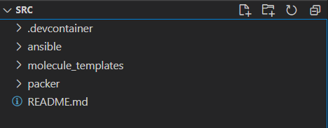
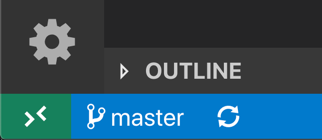

## Setting up & using the Development environment ##

### Using the Provided Development Container ###

#### System requirements ####
 
Windows: 
- [Docker Desktop 2.0+](https://www.docker.com/products/docker-desktop) on Windows 10 Pro/Enterprise. Windows 10 Home (2004+) requires Docker Desktop 2.3+ and the [WSL 2 back-end](https://aka.ms/vscode-remote/containers/docker-wsl2). (Docker Toolbox is not supported. Windows container images are not supported.)

macOS:
- [Docker Desktop 2.0+.](https://www.docker.com/products/docker-desktop)

Linux: 
- Docker CE/EE 18.06+ and [Docker Compose 1.21+.](https://docs.docker.com/compose/install) (The Ubuntu snap package is not supported.)

 
### Install Docker ###
 
Install and configure [Docker](https://www.docker.com/get-started) for your operating system.

### Windows / macOS:

Install [Docker Desktop for Windows/Mac](https://www.docker.com/products/docker-desktop)

Right-click on the Docker task bar item select **_Settings / Preferences_** and update **_Resources > File Sharing_** with any locations your source code is kept. See tips and tricks for troubleshooting.

If you are using WSL 2 on Windows, to enable the [Windows WSL 2 back-end](https://aka.ms/vscode-remote/containers/docker-wsl2): Right click on the Docker taskbar item and select **_Settings_**. Check **_Use the WSL 2 based engine_** and verify your distribution is enabled under **_Resources > WSL Integration_**.

### Linux:
Follow the official install instructions for Docker CE/EE for your distribution. If you are using Docker Compose, follow the [Docker Compose directions](https://docs.docker.com/compose/install/) as well.

Add your user to the docker group by using a terminal to run: 
```bash
sudo usermod -aG docker $USER
```
* Sign out and back in again so your changes take effect.

### Install Visual Studio Code.
[Visual Studio Code](https://code.visualstudio.com/) or [Visual Studio Code Insiders](https://code.visualstudio.com/insiders/)

Install the Remote Development extension pack.
Install the needed vscode extension, [Remote Development extension](https://aka.ms/vscode-remote/download/extension)
**Opening the development container
Note:**

<mark>**To use the provided development container, you will need to open the _./ansible/src/_ folder in VS code to start.**



Start VS Code, run the Remote-Containers: Open Folder in Container... command from the **Command Palette (F1)**

or click the quick actions **Status bar item** in lower left corner and select Remote-Containers: Open Folder in Container



For more information, please see the [extension documentation.](https://aka.ms/vscode-remote/containers) 