# [Testing a Windows image](#testing-a-windows-image) #

a. [Creating a new Role (Windows)](#creating-a-new-role-(windows))

b. [Adding Molecule structure an existing Ansible role (Windows)](#adding-molecule-structure-an-existing-ansible-role-(windows))

c. [Using an already existing Ansible Playbook (Windows)](#using-an-already-existing-ansible-playbook-(windows))

d. [Writing an Ansible test for a Windows VM](#writing-an-ansible-test-for-a-windows-vm)

1. [Creating a Molecule test for an Ansible role (Windows)](#creating-a-molecule-test-for-an-ansible-role-(windows))
2. [Calling Ansible roles' Molecule tests from an Ansible Playbook Molecule testing](#calling-ansible-roles'-molecule-tests-from-an-ansible-playbook-molecule-testing)

e. [Running Molecule (Windows)](#running-molecule-(windows))

1. [Login to Azure (Windows)](#login-to-azure-(windows))
2. [Creating the VM with Molecule create (Windows)](#creating-the-vm-with-molecule-create-(windows))
3. [Executing the Ansible Playbook/Role with Molecule converge (Windows)](#executing-the-ansible-playbook/role-with-molecule-converge-(windows))
4. [Verifing/Testing the provisond VM with Molecule verify (Windows)](#verifing/testing-the-provisond-vm-with-molecule-verify-(windows))
5. [Linting the Ansible code with Molecule lint (Windows)](#linting-the-ansible-code-with-molecule-lint-(windows))
6. [Tearing down the VM with Molecule destroy (Windows)](#tearing-down-the-vm-with-molecule-destroy-(windows))
7. [Doing it all with Molecule test (Windows)](#doing-it-all-with-molecule-test-(windows))

## Testing a Windows image ##

When looking to test the Ansible provisioning steps that create a Windows image, there are three ways to include the Molecule structure:

1. Create a brand new Ansible role with the Molecule structure.
2. Add the Molecule structure to an existing Ansible role.
3. The last way is to add the Molecule structure for an already existing Ansible Playbook.

### Creating a new Role (Windows) ###

Creating a new Ansible role, including the Molecule configuration needed to test the role, is very simple when using the provided cookiecutter template. The cookiecutter template will configure Molecule to use an Azure-based Windows VM as the testing platform.  For more information on the cookiecutter template itself, please see the Overview of provided templates section.

To create a new Ansible role using the cookiecutter template:

In a shell prompt, cd to the directory that the roles are stored. In the example case, this would be the ansible/roles directory.

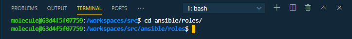

Next we run the following command to generate the new Ansible role:

```bash
cookiecutter "../../molecule-templates/new_windows_azure_role_template/""
```

You then will be asked to provide a role name, enter the name you wish to call the role:

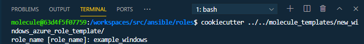

Then you will be asked to provide a prefix for naming the Azure resource group, VM, and other components. Having a prefix set like this is useful for quickly identifying resources and services in the Azure portal. The default is to use ECD-Molecule as the prefix and can be selected by pressing enter, or you can provide a different prefix here instead:

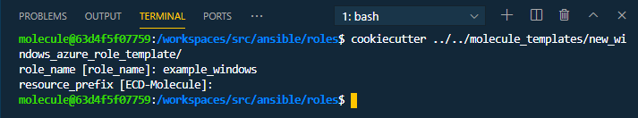

Once completed, you will now see the new role created in the directory structure:

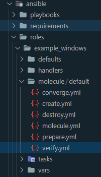

### Adding Molecule structure an existing Ansible role (Windows) ###

Suppose you already have an existing Ansible role and would like to add Molecule testing. In that case, you can use the provided cookiecutter template to add the needed files and directory structure quickly. The cookiecutter template will create an Azure-based Windows VM to test the Ansible role against.

To use the template, first in a shell, cd to the existing role in the roles directory. In our example case, that would be the ansible/roles directory.


Then we call the cookiecutter template to add the directory and files to our existing role:

```bash
cookiecutter "../../molecule-templates/existing_windows_azure_role_template/"
```

When ran the template will ask us a few questions. The first is the name of the existing role name. Enter the name of the role you want to add the Molecule structure. **The name must match the folder name of the existing role. In our example case that is existing_windows_role**

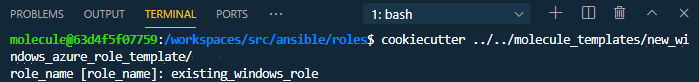

Next, the template will ask for a resource name prefix. The prefix will be used for naming the Azure resource group, VM, and other components. Having a prefix set like this is useful for quickly identifying resources and services in the Azure portal. The default is to use ECD-Molecule as the prefix and can be selected by pressing enter, or you can provide a different prefix here instead:

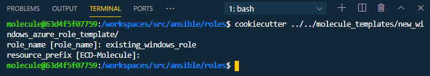

Once completed, you will now see the new Molecule directory created in the existing roles'  directory structure:

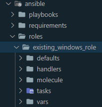

### Using an already existing Ansible Playbook (Windows) ###

If you have an existing Ansible Playbook and want to add Molecule testing, you can use the provided Cookiecutter template to add the needed files and directory structure quickly. The provided template will create an Azure-based Windows VM to run and test the Ansible roles defined in the playbook. To use the template, follow these steps:

First, in a shell, cd to the directory where the Ansible playbooks are stored. In our example case, that is the ansible/playbooks directory:

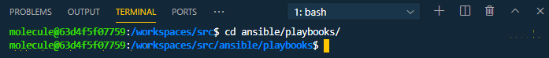

Next, we will call the template to create a Molecule scenario for the existing Ansible playbook:

```bash
cookiecutter "../../molecule-templates/exisiting_windows_azure_playbook_template/"
```

When executed, the template asks us a few questions. The first is the name of the scenario, which is the name of the playbook (see the Molecule Scenario section for more information). Enter the name of the playbook (scenario) we want to add Molecule testing. In our example case, it is existing_playbook:

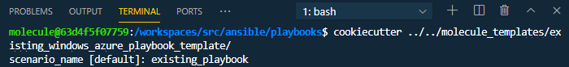

The last question asked is for the prefix to use when naming resources, such as the Azure resource group, VM, and other components. Having a prefix set like this is helpful for quickly identifying resources and services in the Azure portal. The default is to use ECD-Molecule as the prefix and can be selected by pressing enter, or you can provide a different prefix here instead:

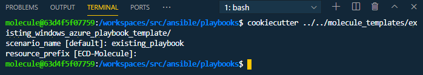

Once completed, you will now see the new Molecule scenario directory created in the Ansible playbooks' directory structure:

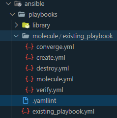

### Writing an Ansible test for a Windows VM ###

When testing Windows-based ../images, Ansible-based tests can be implemented. Tests roles defined in the verify.yml file will automatically run during the Molecule verify step.

#### Creating a Molecule test for an Ansible role (Windows) ####

To create a Molecule test that will verify an Ansible role output results, we can use Ansible tasks themselves to define the tests. To put it simply, we can create a task, such as a shell command, with a registered result. We then assert against the registered result of the command to complete our test.

The following is an example Ansible task-based test. This test will verify the version of Windows running on the VM.

Open the verify.yml file located in the roles molecule directory. In our example case, this is **_ansible/roles/example_windows_role/molecule/default/verify.yml_**

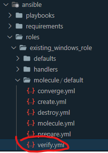

In the file, add the following:

```bash
---


- hosts: all


gather_facts: False


tasks:


   - name: Check Windows Version


     win_command: cmd /c ver


     register: response


   - assert: 


         that: "'Microsoft Windows' in response.stdout"


   - assert:


         that: "'Version 10.0.17763.1577' in response.stdout"

```

Now whenever the Molecule verify step is called on this role, the test will be executed and the results displayed in the shell output:

<< win test run pic>>

#### Calling Ansible roles' Molecule tests from an Ansible Playbook Molecule testing ####

To test an Ansible playbook with Molecule, each of the Ansible roles defined in the playbook has its respective tests called. To achieve this, we need to specify the tests we want to call in the playbooks Molecule scenarios verify.yml.

To demonstrate, let's look at an example playbook. In our example Ansible playbook folder, we have a Molecule directory with our example scenario:


In the scenario folder, we have a verify.yml file. In the file, we define the roles tests we wish to call as part of the playbook testing step:

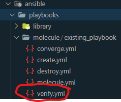

When Molecules' verify command is executed for this playbook, the defined roles' test will, in turn, be executed, and the output displayed in the shell window:

<< playbook test output pic>>

### Running Molecule (Windows) ###

Now let's go through the steps of running the Molecule testing suite. We will cover the individual steps and how to call them separately. We will also look at how to call all the testing suite steps for all the playbooks using one command.

#### Log in to Azure (Windows) ####

The first step before we call any Molecule commands, we must log in to our Azure account. To do this, we will use the install Azure CLI tool.

From a shell, call the following command:

```bash
az login
```

The Molecule commands use your current, active Azure subscription. To see the subscription you are currently using, we can run the az account show command:

```bash
az account show --output table
```

To switch to a different subscription, use az account set with the subscription ID or name you want to switch to.

```bash
az account set --subscription "My Subscription"
```

Your subscriptions have both a name and an ID, which is a GUID. You can use either of these for the commands. If you use a name that includes spaces, use quotation marks.

We are now signed in to Azure and have our active subscription set!

#### Creating the VM with Molecule create (Windows) ####

To create the Azure-based VM to test the Ansible tasks on, we use the Molecule create command. The Molecule create command will provision a VM based on the settings and parameters specified in the molecule.yml file (see the Understanding the Molecule structure section for more information).

It is important to note a slight difference in how we call Molecule create for an Ansible role and an Ansible playbook.

For an Ansible playbook, we must specify the name of the scenario we are using. For example, if we wanted to call create on our example playbook, we would do the following:

First in a shell, we cd to the Ansible playbooks' directory:


Then we call the Molecule create command specifying the scenario with the -s flag:

```bash
molecule create -s example
```

For an Ansible role, it is a little simpler. We do not need to specify the scenario by default. We only need to call the create command from the Ansible roles' directory. For our example role, the steps would be as follows:

First, in a shell, we cd to the Ansible role directory we want to create:


Then we can call the Molecule create command for the role:

```bash
molecule create
```

Note the first run will take some time to complete.

Note once the infrastructure is created, it must be destroyed when not needed. See the Tearing down the VM with Molecule destroy section.

#### Executing the Ansible Playbook/Role with Molecule converge (Windows) ####

To run the Ansible tasks on our newly provisioned VM, we use the Molecule converge command. The Molecule converge command will call the role/playbook specified in the converge.yml file (see the Understanding the Molecule structure section for more information).

It is important to note a slight difference in how we call Molecule converge for an Ansible role and an Ansible playbook.

For an Ansible playbook, we must specify the scenario we want to use when calling the converge command. For example, if we wanted to call converge on our example playbook, we would do the following:

First in a shell, we cd to the Ansible playbooks' directory:


Then we call the Molecule converge command specifying the scenario with the -s flag:

```bash
molecule converge -s example
```

For an Ansible role, it is a little simpler. We do not need to specify the scenario by default. We only need to call the converge command from the Ansible roles' directory. For our example role, the steps would be as follows:

First, in a shell, we cd to the Ansible role directory we want to create:


Then we can call the Molecule converge command for the role:

```bash
molecule create
```

Once completed, the VM is now fully provisioned and can be tested against. In the next section, we will look at calling tests to verify the Ansible steps output was performed correctly.

#### Verifying/Testing the provisioned VM with Molecule verify (Windows) ####

To test the outcomes of the Ansible tasks ran during the Molecule converge step, we use the Molecule verify command. The Molecule verify command will call the tests specified in the verify.yml file (see the Understanding the Molecule structure section for more information).

It is important to note a slight difference in how we call Molecule verify for an Ansible role and an Ansible playbook.

For an Ansible playbook, we must specify the scenario we want to use when calling the verify command. For example, if we wanted to call verify on our example playbook, we would do the following:

First in a shell, we cd to the Ansible playbooks' directory:


Then we call the Molecule verify command specifying the scenario with the -s flag:

```bash
molecule verify -s example
```

For an Ansible role, it is a little simpler. We do not need to specify the scenario by default. We only need to call the verify command from the Ansible roles' directory. For our example role, the steps would be as follows:

First, in a shell, we cd to the Ansible role directory we want to create:


Then we can call the Molecule verify command for the role:

```bash
molecule verify
```

When the verify command is called, the tests defined will execute, and the results will be printed out in the shell output:

<< windows test run output pic >>

#### Linting the Ansible code with Molecule lint (Windows) ####

One good step to periodically run locally is to lint your code. Linting the Ansible code will check syntax and structure to ensure the code base stays clean and follows best practice guidelines. To lint the Ansible roles and playbooks, we use the Molecule lint command. The Molecule lint command will call the linting steps defined in the molecule.yml files' linting section (see the Understanding the Molecule structure section for more information). It will use the specific tools default rules, unless otherwise defined in an exception file, for example, the yamllint and ansible-lint files, respectively.

It is important to note a slight difference in how we call Molecule lint for an Ansible role and an Ansible playbook.

For an Ansible playbook, we must specify the scenario we want to use when calling the lint command. For example, if we wanted to call lint on our example playbook, we would do the following:

First in a shell, we cd to the Ansible playbooks' directory:


Then we call the Molecule lint command specifying the scenario with the -s flag:

```bash
molecule lint -s example
```

For an Ansible role, it is a little simpler. We do not need to specify the scenario by default. We only need to call the verify command from the Ansible roles' directory. For our example role, the steps would be as follows:

First, in a shell, we cd to the Ansible role directory we want to create:


Then we can call the Molecule lint command for the role:

```bash
molecule lint
```

When executed, the linting tools will check all needed files and print out any issues found to the shell output window:

<< linting output pic >>

#### Tearing down the VM with Molecule destroy (Windows) ####

Once all your testing is done, it is essential to tear down the Azure-based testing infrastructure we have created. Tearing down the infrastructure when we are done with it will ensure no extra charges are incurred and will keep our resources tidy. To tear down the Molecule testing infrastructure, we use the Molecule destroy command. The Molecule destroy command is essentially the opposite of the create command and will remove resources based on the destroy.yml file (see the Understanding the Molecule structure section for more information).

It is important to note a slight difference in how we call Molecule lint for an Ansible role and an Ansible playbook.

For an Ansible playbook, we must specify the scenario we want to use when calling the destroy command. For example, if we wanted to call destroy on our example playbook, we would do the following:

First in a shell, we cd to the Ansible playbooks' directory:


Then we call the Molecule destroy command specifying the scenario with the -s flag:

```bash
molecule destroy -s example
```

For an Ansible role, it is a little simpler. We do not need to specify the scenario by default. We only need to call the verify command from the Ansible roles' directory. For our example role, the steps would be as follows:

First, in a shell, we cd to the Ansible role directory we want to create:


Then we can call the Molecule destroy command for the role:

```bash
molecule destroy
```

When executed, the destroy command will tear down any created resources and displays the output in the shell window:

<< destroy output pic >>

#### Doing it all with Molecule test (Windows) ####

The steps in the proceeding sections detailed how to run the various Molecule steps individually. While this is great when testing locally, sometimes you might want to run all the Molecule steps at once, enter the Molecule test command. The Molecule test command runs all the previously mentioned steps in order. For example, it lints, creates, converges, verifies, and finally destroys all with one command.  

Once again, it is essential to note a slight difference in how we call Molecule lint for an Ansible role and an Ansible playbook.

For an Ansible playbook, we must specify the scenario we want to use when calling the test command. For example, if we wanted to call test on our example playbook, we would do the following:

First in a shell, we cd to the Ansible playbooks' directory:


Then we call the Molecule test command specifying the scenario with the -s flag:

```bash
molecule test -s example
```

For an Ansible role, it is a little simpler. We do not need to specify the scenario by default. We only need to call the test command from the Ansible roles' directory. For our example role, the steps would be as follows:

First, in a shell, we cd to the Ansible role directory we want to create:


Then we can call the Molecule test command for the role:

```bash
molecule test
```

When executed, the test command will run through all the Molecule steps and print each of their outputs in the shell window as they complete.

<< test output pic >>
